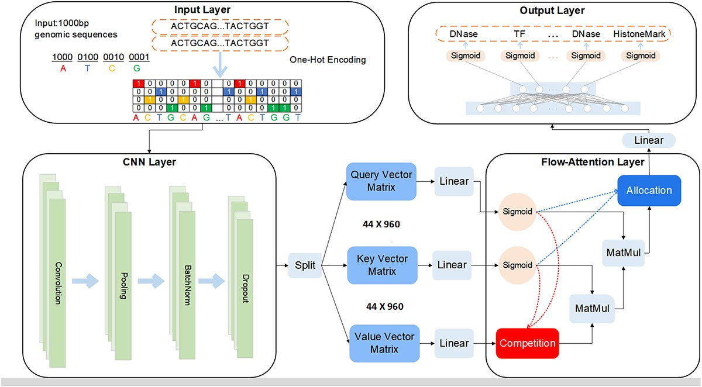

# DeepFormer Refactored

A practical and runnable DeepFormer repository with a reconstructed MAT-based route for data loading, forward testing, tiny training, lightweight evaluation, and notebook-based demonstration.

---

## Method overview

DeepFormer is a DNA-sequence function prediction model proposed for identifying the functional properties of genomic sequences.  
The method combines convolutional feature extraction with attention-based sequence modeling, so that both local sequence patterns and higher-level sequence interactions can be captured within a unified framework.

In this repository, DeepFormer is used as the core model, while the surrounding workflow is reorganized into a clearer and more practical engineering structure.

<p align="center">
  
</p>

---

## This repository

This repository mainly focuses on making the current DeepFormer workflow easier to understand, run, and extend.

At the current stage, it includes:

- reconstructed `train.mat / valid.mat / test.mat`
- MAT structure inspection
- demo subset loading from `.npz`
- DeepFormer model instantiation
- forward-pass validation
- tiny demo training
- lightweight demo evaluation
- notebook-based demonstration


---

## Repository structure

```text
deepformer-refactored/
├── config/                  # configuration files
├── data/                    # MAT files, demo subsets, and data notes
├── docs/                    # extended project documentation
├── models/                  # model definitions
├── notebooks/               # notebook-based demo
├── results/                 # logs and lightweight result summaries
├── scripts/                 # runnable scripts
├── training/                # training/evaluation-related code
├── utils/                   # loaders and helper functions
├── assets/                  # figures used in the repository
├── README.md
├── USAGE.md
└── requirements.txt
```

---

## Environment setup

A conda environment is recommended.

```bash
conda create -n deepformer_clean python=3.9 -y
conda activate deepformer_clean
pip install -r requirements.txt
```

If notebook execution is needed:

```bash
pip install ipykernel notebook jupyterlab
python -m ipykernel install --user --name deepformer_clean --display-name "Python (deepformer_clean)"
```

Optional check:

```bash
python -c "import sys; print(sys.executable)"
```

---

## Required data files

The current runnable route assumes the following files are available under `data/raw_deepsea/`.

### Full MAT files
- `data/raw_deepsea/train.mat`
- `data/raw_deepsea/valid.mat`
- `data/raw_deepsea/test.mat`

### Demo subset files
- `data/raw_deepsea/demo_subset/train_demo_256.npz`
- `data/raw_deepsea/demo_subset/valid_demo_256.npz`
- `data/raw_deepsea/demo_subset/test_demo_256.npz`

The MAT files are reconstructed large-scale data artifacts.  
The demo subset files are smaller extracted files used for quick testing and demonstration.

---

## Quick start

If you only want to verify that the current repository is runnable, execute the following commands in order:

```bash
python scripts/test_deepsea_demo_npz.py
python scripts/test_deepformer_forward.py
python scripts/run_deepformer_demo_train.py
python scripts/run_deepformer_demo_eval.py
```

This is the shortest practical execution route in the current repository.
---

## Running procedure

### Step 1. Confirm the repository root

```bash
pwd
```


### Step 2. Activate the environment

```bash
conda activate deepformer_clean
```

### Step 3. Test demo subset loading

```bash
python scripts/test_deepsea_demo_npz.py
```

This checks:

- whether the `.npz` demo files can be opened
- whether input and label shapes are correct
- whether the DataLoader works correctly

### Step 4. Inspect the DeepFormer constructor

```bash
python scripts/inspect_deepformer_signature.py
```

For the current demo route, the expected constructor arguments are:

- `sequence_length = 1000`
- `n_targets = 919`

### Step 5. Run a forward-pass validation

```bash
python scripts/test_deepformer_forward.py
```

This checks whether demo data can be passed through the model and whether the output shape is correct.

### Step 6. Run tiny demo training

```bash
python scripts/run_deepformer_demo_train.py
```

This is a small demonstration training run used to verify:

- loss computation
- backward propagation
- optimizer update
- checkpoint saving

Typical output files include:

- `results/deepformer_demo_train_log.txt`
- `results/deepformer_demo_result_summary.txt`
- `results/deepformer_demo_model.pt`

### Step 7. Run lightweight demo evaluation

```bash
python scripts/run_deepformer_demo_eval.py
```

This loads the demo checkpoint and performs a lightweight evaluation on the validation demo subset.

Typical output files include:

- `results/deepformer_demo_eval_log.txt`
- `results/final_demo_status.txt`

---

## Notebook demo

The repository also contains a notebook-based demo:

- `notebooks/deepformer_gpu_demo_notebook.ipynb`

This notebook includes:

1. project root setup
2. dependency import
3. device checking
4. demo subset loading
5. DataLoader construction
6. DeepFormer construction
7. forward-pass testing
8. tiny training
9. validation
10. checkpoint and log saving

---

## Current MAT route

The current runnable route is a MAT-based route:

1. public data are reconstructed into MAT files
2. MAT structure is inspected
3. small demo subsets are extracted
4. the demo subsets are connected to a PyTorch-compatible loader
5. the loader output is connected to DeepFormer
6. forward / train / evaluation scripts are built on top of this route

So the current main route is not yet the original YAML-based FASTA/BED/TXT runtime path, but a practical MAT-based execution route.

---

## Data shapes

From the reconstructed MAT files:

### Training set
- `trainxdata`: `(4400000, 1000, 4)`
- `traindata`: `(4400000, 919)`

### Validation set
- `validxdata`: `(8000, 1000, 4)`
- `validdata`: `(8000, 919)`

### Test set
- `testxdata`: `(455024, 1000, 4)`
- `testdata`: `(455024, 919)`

This means:

- each input sample is a one-hot encoded DNA sequence of length 1000
- each label is a 919-dimensional target vector

A more detailed summary is stored in:

- `results/deepsea_mat_summary.txt`

---

## Output files

The most important result files currently include:

- `results/deepsea_mat_summary.txt`
- `results/deepformer_demo_train_log.txt`
- `results/deepformer_demo_result_summary.txt`
- `results/deepformer_demo_eval_log.txt`
- `results/final_demo_status.txt`

---

## Additional documentation

If more detailed notes are needed, refer to:

### Data-related documents
- `docs/data_layer_best_practices.md`
- `docs/data_layer_current_status.md`

### Method-related documents
- `docs/methodology_layer_best_practices.md`
- `docs/methodology_layer_current_status.md`

### Interpretability-related documents
- `docs/interpretability_layer_best_practices.md`
- `docs/interpretability_layer_roadmap.md`

### Project notes
- `docs/deepformer.qmd`
- `docs/final_project_status.md`
- `docs/defense_talking_points.md`

---

## Citation

If you use `DeepFormer` in your work, please cite:

> Yao Z, Zhang W, Song P, Hu Y, Liu J. DeepFormer: a hybrid network based on convolutional neural network and flow-attention mechanism for identifying the function of DNA sequences. Briefings in Bioinformatics. 2023;24(2):bbad095. doi: https://doi.org/10.1093/bib/bbad095